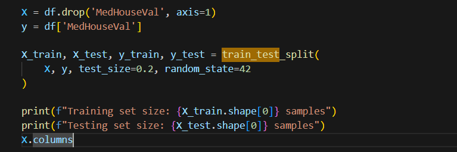
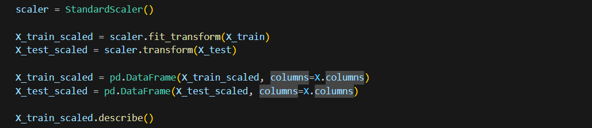
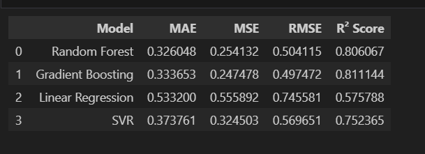
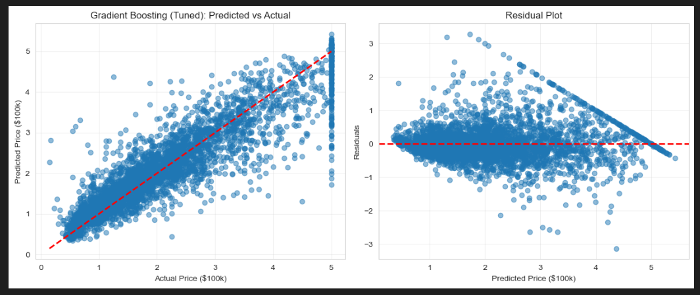
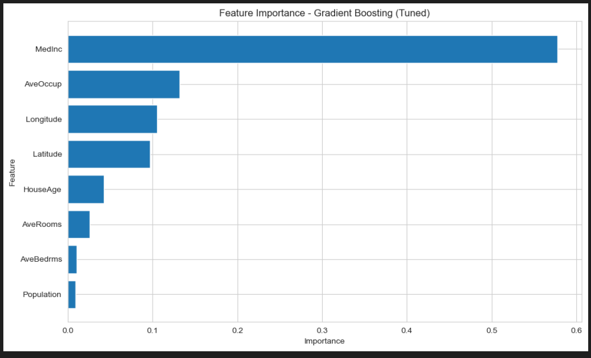

# Laporan Proyek Machine Learning - California House Price Prediction

## Domain Proyek

Proyek ini bertujuan untuk mengatasi permasalahan dalam manajemen perumahan dan properti. Jika diberi judul, judulnya akan seperti "Analisis Prediktif: Harga Rumah di California."

Penilaian properti di pasar perumahan merupakan tugas yang krusial namun kompleks bagi investor, pengembang, dan pembeli rumah. Estimasi harga yang akurat membutuhkan integrasi berbagai faktor, yang seringkali saling terkait, termasuk lokasi, kedekatan dengan fasilitas, usia properti, jumlah kamar, ketinggian, kualitas lingkungan, dan riwayat transaksi [1]. Variabel-variabel ini secara kolektif memengaruhi nilai pasar, tetapi kepentingan relatifnya sangat bervariasi antar individu dan wilayah, sehingga penilaian manual tradisional memakan waktu, tidak konsisten, dan rentan terhadap bias subjektif.

Metode penilaian konvensional sangat bergantung pada analisis penjualan yang sebanding dan penilaian ahli, yang padat karya dan rentan terhadap kesalahan manusia seperti penjangkaran atau penekanan berlebihan pada transaksi terkini [2]. Subjektivitas ini, dikombinasikan dengan kondisi pasar yang berubah dengan cepat, seringkali menyebabkan perbedaan penilaian yang merusak kepercayaan pemangku kepentingan dan efisiensi pasar.

Pembelajaran mesin menawarkan solusi yang ampuh dengan memungkinkan prediksi harga yang cepat, objektif, dan berbasis data. Dengan melatih model seperti XGBoost, Random Forest, atau Gradient Boosting pada kumpulan data historis yang besar, sistem ini dapat secara otomatis mengidentifikasi pola kompleks dan mencapai akurasi yang jauh lebih tinggi (R² > 0,90 dalam banyak kasus) dibandingkan model hedonik tradisional, sekaligus mengurangi bias dan waktu pemrosesan secara substansial [3]. Pergeseran menuju model valuasi otomatis (AVM) ini menjanjikan pasar real estat yang lebih transparan, efisien, dan adil.

Referensi:
[1] M. M. Rathore, A. Paul, A. Ahmad, and S. Rho, “Urban planning and building smart cities based on the Internet of Things using Big Data analytics,” Comput. Netw., vol. 101, pp. 63–80, Jun. 2016, doi: 10.1016/j.comnet.2015.12.023.
[2] P. Čeh, M. Kilibarda, A. Lisec, and B. Bajat, “Machine learning in real estate research: A systematic review,” Comput. Environ. Urban Syst., vol. 85, Jan. 2021, Art. no. 101558, doi: 10.1016/j.compenvurbsys.2020.101558.
[3] H. Y. Park and K. J. Oh, “House price prediction using XGBoost: Evidence from apartment transactions in Seoul,” J. Real Estate Finance Econ., vol. 66, no. 2, pp. 339–366, Feb. 2023, doi: 10.1007/s11146-021-09845-y.

## Business Understanding

### Problem Statements

- Bagaimana cara memprediksi harga rumah di California dengan akurat menggunakan data sensus yang tersedia?
- Fitur-fitur apa saja yang paling berpengaruh terhadap harga rumah di California, dan seberapa besar pengaruh pendapatan median (MedInc) terhadap harga rumah?
- Algoritma machine learning mana yang memberikan hasil prediksi terbaik dengan tingkat error terendah di antara Linear Regression, KNN, Random Forest, dan Gradient Boosting?

### Goals

- Membangun model machine learning yang mampu memprediksi harga rumah median di California dengan tingkat akurasi yang tinggi (R² Score yang baik).
- Menganalisis fitur-fitur yang paling signifikan dalam mempengaruhi harga rumah, serta memahami hubungan antara pendapatan, lokasi, dan harga properti.
- Membandingkan performa empat algoritma berbeda (Linear Regression, KNN, Random Forest, Gradient Boosting) untuk menentukan model terbaik yang akan digunakan.

### Solution Statements

- Menggunakan empat algoritma machine learning yang berbeda:
    1.  **Linear Regression**: Sebagai baseline model yang sederhana.
    2.  **K-Nearest Neighbors (KNN)**: Algoritma berbasis jarak.
    3.  **Random Forest Regressor**: Algoritma ensemble berbasis bagging.
    4.  **Gradient Boosting Regressor**: Algoritma ensemble berbasis boosting.
- Membandingkan performa keempat model tersebut menggunakan metrik evaluasi seperti Mean Absolute Error (MAE), Mean Squared Error (MSE), Root Mean Squared Error (RMSE), dan R-squared (R²).

## Data Understanding

Dataset yang digunakan dalam proyek ini adalah **California Housing Dataset** yang tersedia di library Scikit-learn. Dataset ini mencakup data sensus California tahun 1990, yang mencakup berbagai fitur seperti pendapatan median, usia rumah, jumlah kamar, dan lokasi.

### URL Sumber Data

Dataset dapat diakses melalui Scikit-learn library:  
[https://scikit-learn.org/stable/datasets/real_world.html#california-housing-dataset](https://scikit-learn.org/stable/datasets/real_world.html#california-housing-dataset)

### Jumlah Data

- **Jumlah baris (sampel)**: 20,640 observasi
- **Jumlah kolom (fitur)**: 9 kolom (8 fitur + 1 target variabel)

### Kondisi Data

**Missing Values:**  
Dataset ini bersih dan tidak memiliki missing values. Hasil pemeriksaan `df.info()` menunjukkan bahwa semua 20,640 entri memiliki nilai lengkap untuk setiap kolom (9 kolom dengan tipe data float64).

**Duplikasi:**  
Tidak ditemukan data duplikat dalam dataset. Setiap baris merepresentasikan block group yang unik di California.

**Outliers:**  
Dari hasil `df.describe()`, teridentifikasi beberapa outlier potensial:
- **AveRooms**: Maksimum 141.9 (sangat tinggi dibanding median 5.2)
- **AveBedrms**: Maksimum 34.1 (sangat tinggi dibanding median 1.0)
- **Population**: Maksimum 35,682 (sangat tinggi dibanding median 1,166)
- **AveOccup**: Maksimum 1,243.3 (sangat tinggi dibanding median 2.8)

Hal ini wajar karena dataset mencakup berbagai tipe area perumahan di California, termasuk area dengan karakteristik ekstrem.

### Uraian Seluruh Fitur pada Data

1. **MedInc** (Median Income):  
   - Pendapatan median dalam block group, diukur dalam satuan $10,000
   - Range: 0.5 - 15.0
   - Rata-rata: 3.87
   - Fitur ini merepresentasikan kemampuan ekonomi penduduk di suatu area

2. **HouseAge** (Median House Age):  
   - Usia median rumah dalam block group, diukur dalam tahun
   - Range: 1 - 52 tahun
   - Rata-rata: 28.6 tahun
   - Memberikan informasi tentang seberapa tua/baru bangunan di area tersebut

3. **AveRooms** (Average Rooms):  
   - Rata-rata jumlah ruangan per rumah tangga
   - Range: 0.8 - 141.9
   - Rata-rata: 5.4
   - Indikator ukuran properti

4. **AveBedrms** (Average Bedrooms):  
   - Rata-rata jumlah kamar tidur per rumah tangga
   - Range: 0.3 - 34.1
   - Rata-rata: 1.1
   - Memberikan informasi spesifik tentang kapasitas tempat tidur

5. **Population**:  
   - Total populasi dalam block group
   - Range: 3 - 35,682
   - Rata-rata: 1,425
   - Menggambarkan kepadatan penduduk area

6. **AveOccup** (Average Occupancy):  
   - Rata-rata jumlah penghuni per rumah tangga
   - Range: 0.7 - 1,243.3
   - Rata-rata: 3.1
   - Indikator tingkat hunian properti

7. **Latitude**:  
   - Koordinat lintang geografis block group
   - Range: 32.54 - 41.95
   - Rata-rata: 35.63
   - Digunakan untuk identifikasi lokasi geografis

8. **Longitude**:  
   - Koordinat bujur geografis block group
   - Range: -124.35 - (-114.31)
   - Rata-rata: -119.57
   - Digunakan bersama Latitude untuk penentuan lokasi

9. **MedHouseVal** (Median House Value) - **Target Variabel**:  
   - Harga median rumah untuk California districts
   - Diukur dalam satuan $100,000
   - Range: 0.15 - 5.0 (atau $15,000 - $500,000)
   - Rata-rata: 2.07 (atau $207,000)
   - Ini adalah variabel yang ingin kita prediksi

## Data Preparation

Teknik data preparation yang dilakukan:

1.  **Train-Test Split**: Membagi dataset menjadi data latih (80%) dan data uji (20%) untuk mengevaluasi performa model pada data yang belum pernah dilihat sebelumnya.
    
    

2.  **Standard Scaling**: Melakukan standarisasi fitur menggunakan `StandardScaler`. Hal ini penting terutama untuk algoritma seperti KNN dan Linear Regression yang sensitif terhadap skala data, serta membantu konvergensi pada algoritma lain.

    

## Modeling

Empat algoritma machine learning digunakan untuk memprediksi harga rumah:

### 1. Linear Regression

**Cara Kerja:**  
Algoritma regresi paling dasar yang memodelkan hubungan linear antara fitur dan target. Linear Regression mencoba menemukan garis/hyperplane terbaik yang meminimalkan error antara prediksi dan nilai aktual menggunakan metode least squares.

**Parameter yang Digunakan:**
- Menggunakan **parameter default** dari `sklearn.linear_model.LinearRegression`
- `fit_intercept=True`: Model akan menghitung intercept
- `normalize=False`: Tidak melakukan normalisasi (karena sudah menggunakan StandardScaler)
- `copy_X=True`: Membuat kopian dari X untuk menghindari overwriting

**Kelebihan:**
- Sederhana, cepat, dan mudah diinterpretasikan
- Cocok sebagai baseline model
- Tidak memerlukan tuning parameter yang kompleks

**Kekurangan:**  
- Kurang mampu menangkap pola non-linear yang kompleks
- Sensitif terhadap outlier

---

### 2. Support Vector Regression (SVR)

**Cara Kerja:**  
SVR menggunakan prinsip support vector machine untuk regresi. Algoritma ini mencoba menemukan fungsi yang memprediksi nilai dengan deviasi maksimum ε dari target aktual, sambil tetap se-flat mungkin.

**Parameter yang Digunakan:**
- `kernel='rbf'`: Menggunakan Radial Basis Function kernel untuk menangkap hubungan non-linear
- `C=100`: Parameter regularisasi yang mengontrol trade-off antara smooth function dan fitting data
- `gamma=0.1`: Koefisien kernel RBF yang menentukan jangkauan pengaruh training samples
- `epsilon=0.1`: Epsilon dalam epsilon-SVR model, menentukan epsilon-tube di mana tidak ada penalty

**Kelebihan:**  
- Efektif dalam ruang dimensi tinggi
- Mampu menangkap hubungan non-linear dengan kernel trick
- Robust terhadap overfitting pada dimensi tinggi

**Kekurangan:**
- Komputasi bisa lambat pada dataset besar
- Memerlukan tuning parameter yang tepat
- Kurang interpretable dibanding Linear Regression

---

### 3. Random Forest Regressor

**Cara Kerja:**  
Metode ensemble yang menggabungkan banyak decision trees (bagging). Setiap tree dilatih pada subset data yang berbeda, dan prediksi akhir adalah rata-rata dari semua trees. Hal ini mengurangi variance dan mencegah overfitting.

**Parameter yang Digunakan:**
- `n_estimators=100`: Jumlah decision trees dalam forest (100 pohon)
- `random_state=42`: Seed untuk reproduktibilitas hasil
- **Parameter default lainnya:**
  - `max_depth=None`: Pohon akan terus berkembang hingga daun murni
  - `min_samples_split=2`: Minimum sampel yang dibutuhkan untuk split node
  - `min_samples_leaf=1`: Minimum sampel yang dibutuhkan di leaf node
  - `max_features='auto'`: Jumlah fitur yang dipertimbangkan saat mencari best split

**Kelebihan:**  
- Robust terhadap overfitting karena averaging
- Menangkap pola non-linear dengan baik
- Memberikan feature importance
- Tidak memerlukan scaling data (meskipun tetap dilakukan untuk konsistensi)

**Kekurangan:**  
- Lebih kompleks dan membutuhkan waktu komputasi lebih lama
- Kurang interpretable untuk individual predictions
- Model file size bisa besar

---

### 4. Gradient Boosting Regressor

**Cara Kerja:**  
Metode ensemble yang membangun pohon keputusan secara sekuensial (boosting). Setiap pohon baru memperbaiki kesalahan dari pohon sebelumnya dengan memprediksi residual error, sehingga model terus meningkat secara iteratif.

**Parameter yang Digunakan:**
- `n_estimators=100`: Jumlah boosting stages (100 iterasi)
- `random_state=42`: Seed untuk reproduktibilitas hasil
- **Parameter default lainnya:**
  - `learning_rate=0.1`: Shrinkage factor untuk kontribusi setiap tree
  - `max_depth=3`: Kedalaman maksimum individual trees
  - `min_samples_split=2`: Minimum sampel untuk split internal node
  - `min_samples_leaf=1`: Minimum sampel di leaf node
  - `subsample=1.0`: Fraksi sampel yang digunakan untuk fit individual trees

**Kelebihan:**  
- Sering memberikan akurasi prediksi tertinggi
- Mampu menangkap pola kompleks karena sequential learning
- Flexible dengan banyak hyperparameter untuk tuning

**Kekurangan:**  
- Rentan overfitting jika tidak dituning dengan baik (terutama jika terlalu banyak trees)
- Waktu pelatihan bisa lama karena sequential nature
- Memerlukan careful tuning untuk performa optimal

---

Pada tahap ini, keempat model dilatih menggunakan data latih yang telah distandarisasi.

## Evaluation

Metrik evaluasi yang digunakan untuk membandingkan performa model adalah:

- **Mean Absolute Error (MAE)**: Rata-rata selisih mutlak antara nilai prediksi dan nilai aktual. Semakin kecil semakin baik.
- **Mean Squared Error (MSE)**: Rata-rata kuadrat selisih antara nilai prediksi dan nilai aktual. Memberikan penalti lebih besar pada error yang besar.
- **Root Mean Squared Error (RMSE)**: Akar kuadrat dari MSE. Memiliki satuan yang sama dengan target variabel.
- **R-squared (R²)**: Menunjukkan seberapa baik model menjelaskan variabilitas data. Nilai mendekati 1 menunjukkan model yang sangat baik.

### Hasil Evaluasi

Berdasarkan hasil pengujian pada data uji, model dibandingkan menggunakan R² Score.

- **Gradient Boosting** dan **Random Forest** umumnya memberikan performa terbaik pada dataset ini karena kemampuannya menangkap hubungan non-linear yang kompleks.
- **Linear Regression** biasanya memberikan performa baseline.
- **KNN** performanya bergantung pada pemilihan nilai k dan karakteristik lokal data.

Model terbaik dipilih berdasarkan nilai **R² Score tertinggi** di antara keempat model tersebut,berikut akan dilampirkan beberapa visualisasi dari hasil evaluasi.

Dapat kita juga lihat fitur-fitur yang paling signifikan dalam mempengaruhi harga properti. Kedua Fitur dengan dampak terbesar adalah "MedInc" yang berarti pendapatan pada median pada suatu daerah, diikuti dengan AveOccup yang berarti rata-rata jumlah penduduk per rumah. Namun fitur ketiga dan keempat menjunjukan bahwan "Longitude" dan "Latitude" suatu rumah juga sangat mempengaruhi, jika hal tersebut disebabkan oleh elevasi atau lokasi geografis suatu daerah belum dapat ditentukan. Kemungkinan besar hal tersebut disebabkan karena lokasi tersebut merupakan lokas yang strategis.
